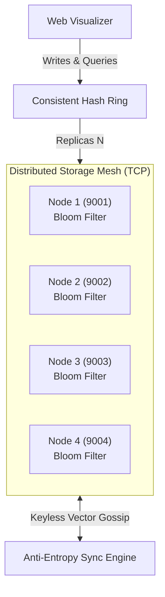

# BloomMesh

A Dynamo-style distributed, fault-tolerant Bloom filter cluster using consistent hashing, tunable quorum consistency, and automatic anti-entropy repair. 

BloomMesh enables high-throughput membership checks, configurable fault tolerance, and self-healing synchronization across independent nodes without transmitting raw keys.

---

## Key Highlights

- **Consistent Hash Ring**: Distributes traffic across nodes using MM3 Hashing with 100 virtual nodes per machine to eliminate hot-spotting.
- **Elastic Topology**: Dynamically add or remove TCP storage nodes with automatic ring rebalancing and cluster-aware consistency scaling.
- **Tunable & Custom Consistency**: Supports presets (Single, Primary+1, Quorum, All) and custom configurations.
- **Keyless Anti-Entropy Repair**: Exploits the algebraic union property of Bloom filters to reconcile drift across peer without transferring raw keys.
- **Modular Live Visualizer**: Real-time browser dashboard in powered by WebSockets.

---

## How It Works



---

## Tech Stack

- **Hashing & Math**: MurmurHash3 with Kirsch-Mitzenmacher optimization and zero-copy bitwise vector unions
- **Systems & Control**: Asynchronous raw TCP engine via Python async, paired with an event-driven WebSocket telemetry plane

---

## Quickstart

1. Setup Environment
    ```bash
    git clone https://github.com/Armaan457/BloomMesh.git
    cd BloomMesh
    ```

2. Create and activate a virtual environment:
    - **macOS/Linux:**
       ```bash
       python -m venv env
       source env/bin/activate
       ```
    - **Windows:**
       ```bash
       python -m venv env
       env\Scripts\activate
       ```

3. Install dependencies:
    ```bash
    pip install -r requirements.txt
    ```

4. Run the test suite:
    ```bash
    python -m unittest discover -s tests
    ```

5. Launch the Cluster Visualizer:
    ```bash
    uvicorn app.server:app --reload --port 8000
    ```
